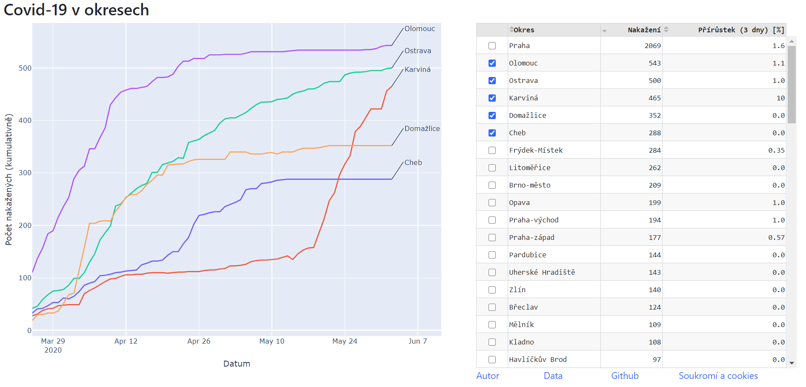

Covid-19 in districts (Covid-19 v okresech)
============
Simple web application (dashboard) showing numbers of Covid-19 confirmed cases in Czech districts. User selects one or more disctricts from the table on the right-hand side. Time series of cumulative confirmed cases in the selected districts are then displayed in the graph on the left-hand side.

   

## Visit the App
Go to: [https://covid19-cz-districts.azurewebsites.net/](https://bit.ly/covid-okresy).
